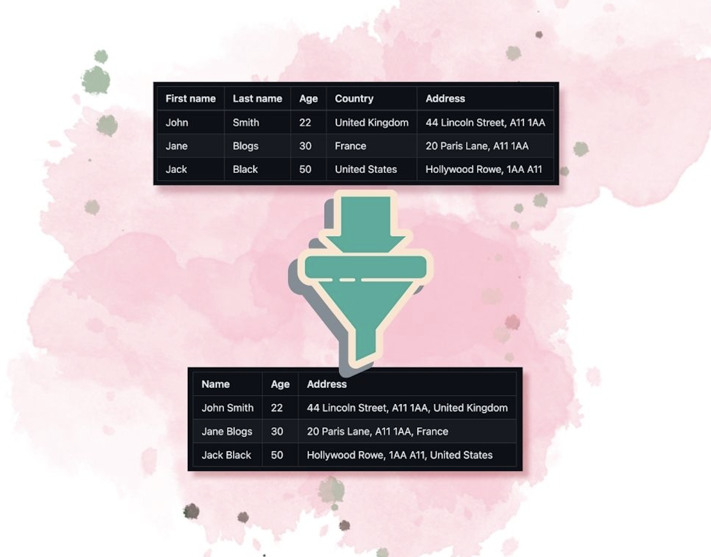

# Tin [Prototype]

> In progress.

Data transformation and conversion as a service.




## Prototype notes

- Not worried about foreign keys - otherwise truncating tables during the prototype stage isn't fun.
- Not worried about tests. Iteration is more important.
- Not worried about getting the schema perfect. As I add more capabilities, the schemas will be refined.
- Not worried about migration tools or ORM. Working in sql is way faster.
- No design up front. Prototyping is just iterating over capabilities quickly.
- No migration tools. Working in things that allow for faster iteration at this stage.

## Features

- [ ] Transformations
  - [ ] Mapping
    - [x] Assign multiple upload fields to a single schema field
    - [ ] Break text into multiple schema fields.
  - [ ] Dates
    - [x] Interpret and format.
    - [ ] Handle internationalisation.
  - [x] Trim fields.
  - [ ] Convert strings into numbers.
  - [x] Allow for required and nullable properties.
  - [ ] Set custom value not in CSV for column across all rows of data.
  - [ ] Set custom value not in upload based on condition eg. - if (X="ABC"), then y for column across all rows of data.
- [ ] Cleaning
  - [ ] Change individual data cells.
  - [ ] Select and remove rows of data.
- [ ] Uploads
  - [x] Upload and parse CSV.
  - [ ] JSON
  - [ ] XML
  - [ ] YAML
  - [ ] XLSX
  - [ ] Xls
  - [ ] tsv and other delimiters
  - [ ] HTML
  - [ ] Multi-HTML
- [ ] A developer can create a schema and send the user an upload link to import a file which has a different format.
- [ ] Auth integration via proxy.

## Built on Nuxt

Look at the [Nuxt 3 documentation](https://nuxt.com/docs/getting-started/introduction) to learn more.

## Setup

Make sure to install the dependencies:

```bash
bun install
```

Run database:

```bash
docker run \
    --detach \
    --name tindb \
    --env MARIADB_USER=tin \
    --env MARIADB_PASSWORD=tin \
    --env MARIADB_ROOT_PASSWORD=tin \
    -p 30066:3306 \
    mariadb:latest
```

Migrate db:

```bash
export MYSQL_PWD=tin
mysql -h 0.0.0.0 --port 30066  < database/migrate.sql
```

## Development Server

Start the development server on `http://localhost:3000`:

```bash
bun run dev
```

## Update schema

A temporary solution in the prototype phase. After making changes to the database, dump db:

```bash
export MYSQL_PWD=tin

mysqldump -h 0.0.0.0 \
    --port 30066 \
    --compact \
    --column-statistics=0 \
    --no-data \
    --databases \
    tin > database/migrate.sql
```

## Example Usage

Example csv file structure:

| Name             | Age | Address                                    |
| ---------------- | --- | ------------------------------------------ |
| John       Smith | 22  | 44 Lincoln Street, A11 1AA, United Kingdom |
| Jane      Blogs  | 30  | 20 Paris Lane, A11 1AA, France             |
| Jack      Black  | 50  | Hollywood Rowe, 1AA A11, United States     |

Create a new JSON schema of the file structure.

```json
{
    "$schema": "http://json-schema.org/draft-06/schema#",
    "type": "object",
    "additionalProperties": false,
    "properties": {
        "name": {
            "type": "string"
        },
        "age": {
            "type": "integer"
        },
        "address": {
            "type": "string"
        },
        "signed_up": {
            "type": "string",
            "format": "date"
        }
    },
    "required": [
        "address",
        "age",
        "name"
    ]
}
```

Define a name for the schema. Paste the JSON schema into *Create Schema* box.

Now, we'll upload a file with a slightly different file structure.

| First name | Last name | Age | Country        | Address                    |
| ---------- | --------- | --- | -------------- | -------------------------- |
| John       | Smith     | 22  | United Kingdom | 44 Lincoln Street, A11 1AA |
| Jane       | Blogs     | 30  | France         | 20 Paris Lane, A11 1AA     |
| Jack       | Black     | 50  | United States  | Hollywood Rowe, 1AA A11    |

First, create the file.

```bash
echo 'First name,Last name,Age,Country,Address,Joined,
John,Smith,22,United Kingdom,"44 Lincoln Street, A11 1AA",11-06-2022,
Jane,Blogs,30,France,"20 Paris Lane, A11 1AA",22-3-2022,
Jack,Black,50,United States," Hollywood Rowe, 1AA A11",4/8/2021,' > ~/tin.csv
```

Upload it via the upload wizard and you'll be able to view the upload in the *Uploads list*.

Extract the data and then view the extracted data.

## Data map notes

```js
{
    item1: ['header1', 'header2'],
    item2: ['header3'],
    item3: ['header4', 'header5']
}
```

## User flow

See: https://www.canva.com/design/DAF1MtF0BRY/3PhfA8SIl2tetypkQpn3bA/edit?utm_content=DAF1MtF0BRY&utm_campaign=designshare&utm_medium=link2&utm_source=sharebutton

- Client uploading multiple files per link

## Production

Build the application for production:

```bash
# npm
npm run build

# pnpm
pnpm run build

# yarn
yarn build

# bun
bun run build
```

Locally preview production build:

```bash
# npm
npm run preview

# pnpm
pnpm run preview

# yarn
yarn preview

# bun
bun run preview
```

Check out the [deployment documentation](https://nuxt.com/docs/getting-started/deployment) for more information.

## Resources

- JTBD - https://www.youtube.com/watch?v=k0NRo3yLqxM&list=TLPQMjQxMTIwMjN4cJ9mzrvatA&index=31

