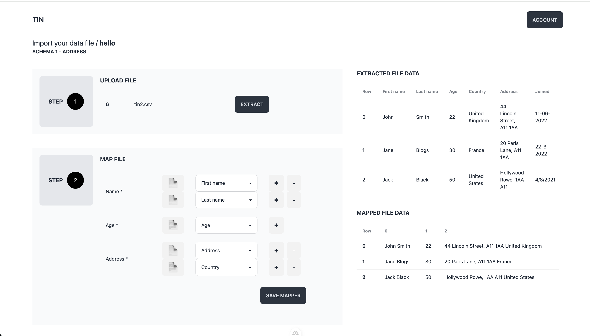
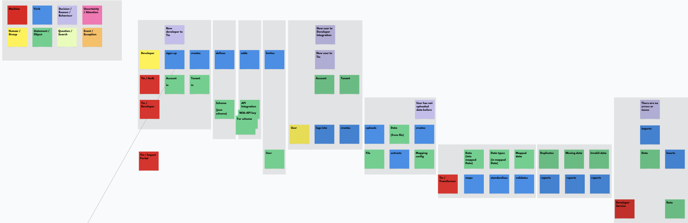

# Tin [Under Development]


[](https://app.codacy.com/gh/gemmadlou/tin/dashboard?utm_source=gh&utm_medium=referral&utm_content=&utm_campaign=Badge_grade)
[](https://github.com/gemmadlou/tin/actions/workflows/test.yaml)


> [!WARNING]
> In progress. Starting the [MVP](#mvp-) phase now so dont trust the documentation too much. It's also not usable in development or production unless you want to contribute to the project. 😅

## What is Tin?

Imports and data transformation as a service.


## Motivations

- **Integrating users.** When we develop APIs, not all users will be able to integrate with them directly. Creating a bulk upload is simple enough, but what if we can tack on "Imports as a service" to make it easier to integrate larger users with more complex data?
  - **What kind of problems do users have?**
    - Their data format is different from ours.
    - Their data has validation issues that need solving before the import.
    - They want an audit history of all the imports.

- **Consolidating lots of messy data**. When consolidating lots of data from a variety of sources into a single consistent format, writing custom scripts to transform each is doable, but Tin will drive transformations via a data-driven configuration.

## Roadmap

As a sole developer, it seems rather overkill to use an app to plan the work where a set of todos will suffice. So instead, I'll be managing the project using [Plain Text Files 🎥](https://www.youtube.com/watch?v=WgV6M1LyfNY), i.e., this Readme.

### POC ✅

A ridiculously basic proof of concept, more to get the idea out of my head and have a basic data transformer.

### Basic prototype ✅

Not much thought went into planning the prototype but it had basic CRUD pages.

The main purpose was to create an extensible schema configuration design that can act as a set of instructions on how to transform data from one format into another. It is by no means complete, but it's a start.

The other purpose was to think about usability, although, no design effort went into it and it wasn't planned up front, just created as I went along.



### MVP 🏗

> [!NOTE]
> **Under development**. As a side project, there are no timelines, just todos and checklists. Features will be grouped by Roadmap stage.

The UI isn't great, so that'll be improved. Also, the UX doesn't quite work nicely either. So that'll be improved too.

I've decided that initial MVP will be something the user can install on their machine. The developer can pass them the JSON schema, and then the user can map their data into the correct format. They can use this to import their data.

It's slightly different than what I have in mind for the full version but this allows me to skip authentication entirely for now. It does mean the developer would still need to create a CSV importer on their side with the necessary validation.

#### Features

- [ ] Users can download and install locally on their desktop potentially via Electron
- [ ] Users can import or create a schema from a schema JSON input, a file or a URL.
- [ ] Users can upload delimited data, xlsx, xls, JSON, YAML and really large files against a schema.
- [ ] Uploads are auto-extracted.
- [ ] Users can map their data.
  - [ ] Users can see their data in a spreadsheet-like format
  - [ ] Users can see rows that cannot be imported due to missing data
  - [ ] Users can see rows with invalid data cells
  - [ ] Users can fix invalid data cells
  - [ ] Users can delete invalid data rows
- Users can download their mapped data as a csv or delimited data, xlsx, JSON and maybe xls.
- [ ] Housekeeping
  - [ ] Add created_at, updated_at and deleted_at to all tables
  - [ ] Use SQLite Db by default
  - [ ] Choose component library

### v1 🪐

> [!NOTE]
> This is future work that doesn't fit into the MVP, sadly. But I'm sure in good time, I'll get to it, eventually/hopefully. What it entails is TBC.

Using [story-storming](https://storystorming.com/), I was able to trace the entire path of a user flow for creating schemas as the developer and importing data as the app user. Visualising the flow makes it easier to plan the work. See [features](#features) for the breakdown.



## Features

### Auth Flows

- [ ] Developer login flow
- [ ] Import portal login flow

### Auth Proxy

Rather than building authentication into Tin, authentication is added via reverse proxy. This may limit where Tin can be deployed to as it requires private deployments of Tin. The idea is every development team have their own SSO or authentication and will want to use that instead, and if they don't, they can use the ready-made [proxy](https://github.com/gemmadlou/tin.auth.proxy) and [UI](https://github.com/gemmadlou/tin.auth.ui).


#### Alpha

<details>

<summary>Handles JWT expiration 🚀</summary>

Upon JWT expiry, the proxy will redirect to the dashboard homepage URL. With the [Tin Auth Proxy implementation that uses Clerkjs](https://github.com/gemmadlou/tin.auth.proxy), that means if the session is still active within Clerk, they will not have to sign in again.

</details>

- [ ] Show user + tenant info in apps behind proxy.
- [ ] Design and development UI.
- [ ] Readme, install instructions and production steps.
  - [ ] Caddy setup
  - [ ] Nginx setup
- [ ] Tests, linting + GitHub Actions.
- [ ] Screenshot + gif example usage.
- [ ] Easy run via single script/binary executable.
- [ ] Fine grained authorisation controls via biscuitsec

### Multi-tenancy

#### Alpha

- [ ] Add tenant and user ids to all tables
- [ ] A development-only GUI component that injects tenancy headers to aid development without needing to go through the Auth proxy. It adds fake tenants and users.

### API Integration

#### MVP

- [ ] Developer can create mapping to their API
- [ ] Developer can setup API key to an API

#### Alpha

- [ ] Developer can distinguish between users and tenants via their authentication proxy setup

### Import Portal

...

#### MVP

- [ ] Redesign from prototype version
- [ ] Add global state management (Pinia)

### Data Extraction

- [ ] File formats
  - [ ] HTML
  - [ ] Multi-HTML
  - [ ] PDF
  - [ ] Images (OCR)
- [ ] Upload via URL link

### Transformer

#### MVP

- [ ] Mapping
  - [x] Assign multiple upload fields to a single schema field
  - [x] Break text into multiple schema fields via a delimiter.
  - [ ] Delimiter catch all
- [ ] Dates
  - [x] Interpret and format.
  - [ ] Handle internationalisation.
- [x] Trim fields.
- [x] Allow for required and nullable properties.
- [x] Set static custom value not in CSV for column(s) across all rows of data.

#### Alpha

- [ ] Set static custom value not in upload based on condition eg. - if (X="ABC"), then y for column across all rows of data.
- [ ] Convert strings into numbers. - Real example required

### House-keeping

#### Alpha

- [ ] Remove unnecessary API urls
- [ ] Record events for all requests as audit trail - transactionable
- [ ] Add table migration tooling
- [ ] GitHub Social previews across all repos
- [ ] Auto Semver across all repos.

## Built on Nuxt

Look at the [Nuxt 3 documentation](https://nuxt.com/docs/getting-started/introduction) to learn more.

## Setup

Make sure to install the dependencies:

```bash
bun install
```

Run database:

```bash
docker run \
    --detach \
    --name tindb \
    --env MARIADB_USER=tin \
    --env MARIADB_PASSWORD=tin \
    --env MARIADB_ROOT_PASSWORD=tin \
    -p 30066:3306 \
    mariadb:latest
```

Migrate db:

```bash
export MYSQL_PWD=tin
mysql -h 0.0.0.0 --port 30066  < database/migrate.sql
```

## Development Server

Start the development server on `http://localhost:3000`:

```bash
bun run dev
```

## Update schema

A temporary solution in the prototype phase. After making changes to the database, dump db:

```bash
export MYSQL_PWD=tin

mysqldump -h 0.0.0.0 \
    --port 30066 \
    --compact \
    --column-statistics=0 \
    --no-data \
    --databases \
    tin > database/migrate.sql
```

## Example Usage

Example csv file structure:

| Name             | Age | Address                                    |
| ---------------- | --- | ------------------------------------------ |
| John       Smith | 22  | 44 Lincoln Street, A11 1AA, United Kingdom |
| Jane      Blogs  | 30  | 20 Paris Lane, A11 1AA, France             |
| Jack      Black  | 50  | Hollywood Rowe, 1AA A11, United States     |

Create a new JSON schema of the file structure.

```json
{
    "$schema": "http://json-schema.org/draft-06/schema#",
    "type": "object",
    "additionalProperties": false,
    "properties": {
        "name": {
            "type": "string"
        },
        "age": {
            "type": "integer"
        },
        "address": {
            "type": "string"
        },
        "signed_up": {
            "type": "string",
            "format": "date"
        }
    },
    "required": [
        "address",
        "age",
        "name"
    ]
}
```

Define a name for the schema. Paste the JSON schema into *Create Schema* box.

Now, we'll upload a file with a slightly different file structure.

| First name | Last name | Age | Country        | Address                    |
| ---------- | --------- | --- | -------------- | -------------------------- |
| John       | Smith     | 22  | United Kingdom | 44 Lincoln Street, A11 1AA |
| Jane       | Blogs     | 30  | France         | 20 Paris Lane, A11 1AA     |
| Jack       | Black     | 50  | United States  | Hollywood Rowe, 1AA A11    |

First, create the file.

```bash
echo 'First name,Last name,Age,Country,Address,Joined,
John,Smith,22,United Kingdom,"44 Lincoln Street, A11 1AA",11-06-2022,
Jane,Blogs,30,France,"20 Paris Lane, A11 1AA",22-3-2022,
Jack,Black,50,United States," Hollywood Rowe, 1AA A11",4/8/2021,' > ~/tin.csv
```

Upload it via the upload wizard and you'll be able to view the upload in the *Uploads list*.

Extract the data and then view the extracted data.

## Data map notes

```js
{
    item1: ['header1', 'header2'],
    item2: ['header3'],
    item3: ['header4', 'header5']
}
```

## User flow

See: https://www.canva.com/design/DAF1MtF0BRY/3PhfA8SIl2tetypkQpn3bA/edit?utm_content=DAF1MtF0BRY&utm_campaign=designshare&utm_medium=link2&utm_source=sharebutton

- Client uploading multiple files per link

## Production

Build the application for production:

```bash
# npm
npm run build

# pnpm
pnpm run build

# yarn
yarn build

# bun
bun run build
```

Locally preview production build:

```bash
# npm
npm run preview

# pnpm
pnpm run preview

# yarn
yarn preview

# bun
bun run preview
```

Check out the [deployment documentation](https://nuxt.com/docs/getting-started/deployment) for more information.

## Resources

- JTBD - https://www.youtube.com/watch?v=k0NRo3yLqxM&list=TLPQMjQxMTIwMjN4cJ9mzrvatA&index=31

## Credits

- Jake Bennett for introducing the [States Machine pattern](https://www.youtube.com/watch?v=1A1xFtlDyzU)
- XStately for teaching how to do state machines.
- Nuxt
- Canva
